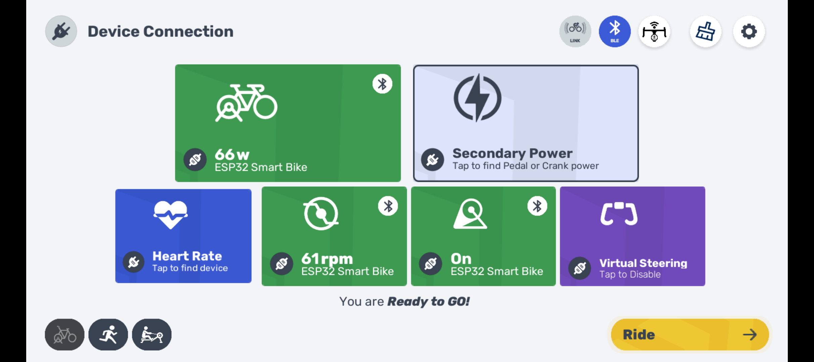

# Echelon to FTMS Smart Bike Dashboard

Turn your Echelon exercise bike into a fully functional Smart Trainer compatible with Zwift, MyWhoosh, TrainerRoad, and more, using an 2.8 inch ESP32 Cheap Yellow Display (CYD). 

This custom Arduino firmware bridges the proprietary Bluetooth protocol of Echelon bikes and broadcasts standard **Bluetooth FTMS (Fitness Machine Service)**. It also provides a sleek, real-time touchscreen dashboard.

## 🚀 Features
* **Real-Time Dashboard:** Displays Speed (mph), Cadence (rpm), Time, Distance (miles), Resistance (0-32), and Estimated Power (Watts).
* **Smart Trainer Integration:** Broadcasts standard BLE FTMS (0x1826) to seamlessly pair with popular cycling apps.
* **ERG Mode Emulation:** Closed-loop ERG mode support to hit target power automatically.
* **Simulation Mode:** Maps virtual gradients (hills) to physical resistance.
* **Touch Controls:** On-screen +/- vertical pill buttons to easily adjust resistance manually.
* **Auto-Pause:** Automatically detects when you stop pedaling.

## 🚲 Compatibility
This project has been tested on the following bikes:
* **Echelon EX3:** Full support. Apps like Zwift and MyWhoosh can read data AND automatically control the resistance (Sim Mode / ERG Mode).
* **Echelon Connect Sport:** Partial support. Apps can read your power, cadence, and speed, but they **cannot** automatically control the bike's resistance due to the bike's hardware limitations.

## 🛠️ Hardware Requirements
* **ESP32 Cheap Yellow Display (CYD)** - specifically the 2.8" ESP32-2432S028R with an XPT2046 resistive touchscreen.
* Micro-USB or USB-C cable for programming and power.
* An Echelon Exercise Bike.

## 💻 Arduino IDE Setup Instructions

### 1. Board Manager Setup
1. Open Arduino IDE. Go to **File > Preferences**.
2. Add the following URL to the *Additional Boards Manager URLs*: 
   `https://dl.espressif.com/dl/package_esp32_index.json`
3. Go to **Tools > Board > Boards Manager**, search for `esp32` by Espressif Systems, and install it.
4. Select the board: **Tools > Board > ESP32 Arduino > ESP32 Dev Module**.

### 2. Install Required Libraries
Go to **Sketch > Include Library > Manage Libraries** and install the following:
* `TFT_eSPI` by Bodmer
* `XPT2046_Touchscreen` by Paul Stoffregen

*(Note: `BLEDevice`, `BLEServer`, `BLEUtils`, and `SPI` are included with the ESP32 core).*

### 3. Configure TFT_eSPI for the CYD
You must configure the `TFT_eSPI` library to work with the specific pins of the Cheap Yellow Display. 
1. Navigate to your Arduino libraries folder (usually `Documents/Arduino/libraries/TFT_eSPI`).
2. Open `User_Setup.h` and configure the settings for the CYD (ILI9341 driver). Alternatively, replace its contents with a standard CYD configuration setup. Key pin mappings for the CYD are generally:
   * `#define ILI9341_DRIVER`
   * `#define TFT_MISO 12`
   * `#define TFT_MOSI 13`
   * `#define TFT_SCLK 14`
   * `#define TFT_CS   15`
   * `#define TFT_DC    2`
   * `#define TFT_RST  -1`
   * `#define TFT_BL   21`

### 4. Compile and Upload
1. Connect your ESP32 CYD to your computer.
2. Select the correct COM port in **Tools > Port**.
3. Copy the provided `.ino` source code into a new sketch.
4. Click **Upload**. 

## 🎮 How to Use
1. **Power On:** Plug in your programmed CYD. The screen will display "Searching..." with a grey indicator.
2. **Pedal to Wake:** Wake up your Echelon bike by pedaling a few times.
3. **Connection:** The CYD will automatically find and connect to the bike. The indicator will turn green, and the dashboard will load.
4. **Pair App:** Open Zwift, MyWhoosh, or your preferred training app. Search for a Smart Trainer/Indoor Bike named **"ESP32 Smart Bike"** and connect. 
5. **Ride!**

## 🔧 Power Estimation
The ESP32 calculates power internally using an exponential curve based on your real-time Cadence and Resistance level. This mimics the standard Echelon power curve, providing accurate relative wattage for training without a physical strain gauge.
